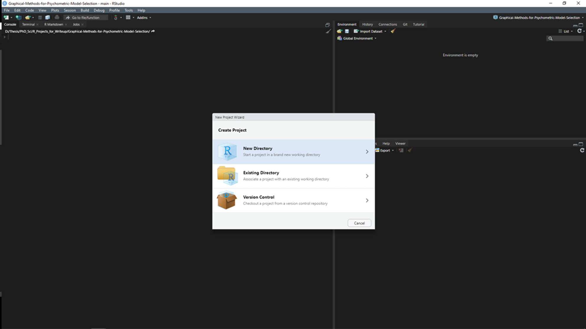
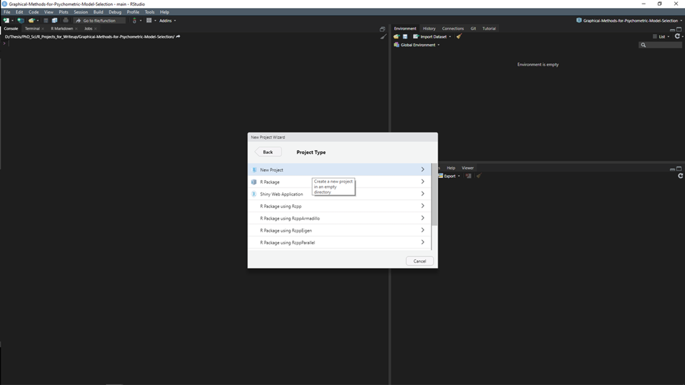
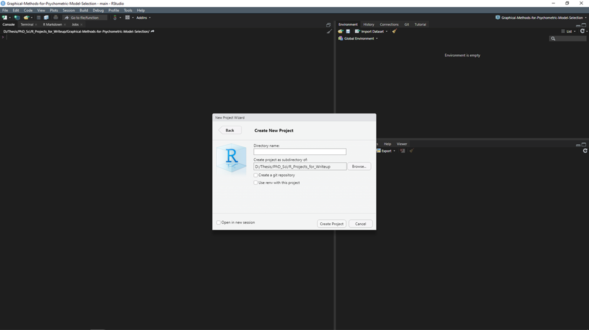

ReadMe
================

## 00 This repository

To install extension R packages copy and paste the following code:

``` r
install.packages("tidyverse")
install.packages("gtools")
install.packages("broom")
install.packages("patchwork")
install.packages("psych")
install.packages("ggnewscale")
```

## 01 Setup

1.  First go to the R website and download the latest version of
    [R](https://cran.r-project.org/bin/windows/).  
2.  Then go to the Rstudio link and download the latest **FREE** version
    of [Rstudio](https://rstudio.com/products/rstudio/download/)  
3.  Once the download has completed, open Rstudio
4.  Click File &gt; New Project…

</br> 

</br>

5.  Download the files from this repository
6.  Copy the repository files into your R project

## 02 Quick Start

### Comments

Use comments to annotate code or block a line of code from running.
Place the `#` at the start of a line of code to comment or comment out.

``` r
# This is commented out, it will not run:
# x <- c(1, 2, 3, 4, 5)  # a numeric vector
# y
```

``` r
# This is NOT commented out, and it will run:
y   <- c(6, 7, 8, 9, 10) # a numeric vector
y # this should print to the output console
```

    ## [1]  6  7  8  9 10

### Help with functions

R packages are well documented. If you are a having an issue with using
a particular function type the code below and it will load the
documentation for that particular function. If you want to know what a
function does, place a question mark before it, and run.

``` r
# these will load the help document for a function:
?c        # concatenate things
?head     # help for the head() function
?mean     # help for the mean function
?sd       # help for the standard deviation function
?round    # rounds numbers
?paste0   # pastes things together
?rnorm    # produces a random sample
?hist     # produces histogram of input list
?summary  # summary values
```

### Variable Assignment

If we run a function without assignment, then it will not save in the
environment.

``` r
rnorm(n = 10, mean = 100, sd = 15)        # outputs directly to the console
```

    ##  [1]  82.32406  77.11855 103.03007 115.11062  88.21190  87.87975  91.20832
    ##  [8]  91.69184 126.56341 105.81675

We need to store the output in an object. This way, our output will save
to the environment and we can do things with it:

``` r
x <- rnorm(n = 1000, mean = 100, sd = 15) # sample 1000 values from a normal distribution
```

### Applying Functions to Objects

We can print the first 6 values of x directly to the console:

``` r
head(x, n = 6L) # show first n = 6 values ## (6L is integer 6)
```

    ## [1] 102.95779  91.77668 108.28186  94.27733 116.23530 119.41802

We can print a summary of x to the console:

``` r
summary(x) 
```

    ##    Min. 1st Qu.  Median    Mean 3rd Qu.    Max. 
    ##   47.06   90.24   99.86  100.02  110.34  143.06

We can produce a histogram of x, viewable in the plots pane:

``` r
hist(x, col = "steelblue")
```

<!-- -->

We can apply a function and save the output as an object…

``` r
x_hat    <- mean(x)  # mean
x_sd     <- sd(x)    # standard deviation
```

…and apply more functions to those objects:

``` r
# formatted and printed to the console
cat(paste0("Mean of x: ",
             round(x_hat, 2),
             "\n",
             "SD of x: ", round(x_sd, 2)))
```

    ## Mean of x: 100.02
    ## SD of x: 14.86

## 03 Data

Gaming Study Data are available at [this OSF
repository](https://osf.io/vnbxk/), and contains survey responses for
13000 participants (Sauter and Draschkow, 2017 ): [read the wiki
here](https://osf.io/vnbxk/wiki/home/). This data has been used as a
teaching example for the Psych and wellbeing summer school 2022.

## 04 R version and packages

The Rscripts for this data have been updated to use R version 4.0.5
(2021-03-31) (Rstudio version 1.4.1106).

In addition a number of extra packages have been used:

<table>
<thead>
<tr>
<th style="text-align:left;">
Package
</th>
<th style="text-align:left;">
Version
</th>
<th style="text-align:left;">
Purpose
</th>
</tr>
</thead>
<tbody>
<tr>
<td style="text-align:left;">
psych
</td>
<td style="text-align:left;">
2.1.3
</td>
<td style="text-align:left;">
General psychology data analysis
</td>
</tr>
<tr>
<td style="text-align:left;">
tidyverse
</td>
<td style="text-align:left;">
1.3.1
</td>
<td style="text-align:left;">
General data management and packages
</td>
</tr>
<tr>
<td style="text-align:left;">
broom
</td>
<td style="text-align:left;">
0.7.6
</td>
<td style="text-align:left;">
Tidying statistical function output
</td>
</tr>
<tr>
<td style="text-align:left;">
dplyr
</td>
<td style="text-align:left;">
1.0.6
</td>
<td style="text-align:left;">
Data management
</td>
</tr>
<tr>
<td style="text-align:left;">
ggplot2
</td>
<td style="text-align:left;">
3.3.3
</td>
<td style="text-align:left;">
Data visualisation
</td>
</tr>
<tr>
<td style="text-align:left;">
patchwork
</td>
<td style="text-align:left;">
1.1.1
</td>
<td style="text-align:left;">
stitching graphics together
</td>
</tr>
<tr>
<td style="text-align:left;">
ggnewscale
</td>
<td style="text-align:left;">
0.4.7
</td>
<td style="text-align:left;">
Adding multiple aesthetic scales to ggplot2
</td>
</tr>
</tbody>
</table>

## 05 Documents

Support articles are stored in the docs folder, the talk slides are
stored as talk-2022.pdf
